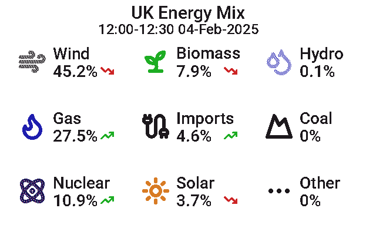

# `Inky Dash Energy Mix Image Feed`

Generates an image that displays the energy mix data for the UK from
the [Carbon Intensity API](https://api.carbonintensity.org.uk/generation). Intended to be used in conjunction with
the [Inky Dash](https://github.com/r-rayns/inky_dash) image-feed mode.

## Output 🖼️

The generated image is 640x400px in dimensions and uses a 7 colour palette, making it suitable for the following
displays:

- [Inky Impression 4"](https://shop.pimoroni.com/products/inky-impression-4?variant=39599238807635)
- [Inky Impression 5.7"](https://shop.pimoroni.com/products/inky-impression-5-7?variant=32298701324371)
- [Inky Impression 7.3"](https://shop.pimoroni.com/products/inky-impression-7-3?variant=40512683376723)

**Example output**



**Example output displaying on an Inky Impressions 4"**


## Setup 🛠️

1. Download this repository onto the device you wish to run it from.
2. If you have [Poetry](https://python-poetry.org/) installed, run `poetry install` to install the dependencies. If you
   do not have Poetry installed, you can install dependencies by creating a new Python virtual environment and running
   `pip install -r requirements.txt`.
3. From the project root run; `poetry run python3 -m src.app` or if you are not using Poetry; `python3 -m src.app`.
4. A png image will be created in the root of the project directory called "energy_data.png".
5. The image is updated every 15 minutes from the start of the hour.
6. If you are using the `--server` flag, the image will be hosted at http://localhost:9000/energy_data.png.

### Flags

- `--server`: Starts a basic HTTP server that hosts the generated image.
- `--port`: Port the server should listen on, **default 9000**.

### Running as a service

A systemd file can be used to run the image generator as a service.

1. Create a new file called `inky_uk_energy.service` in `/etc/systemd/system/`.

2. Copy the example below into the new file. `WorkingDirectory` points to the project directory. The `ExecStart` path
   should use the Python binary in your virtual environment to run `src/app.py`. Replace `your_username` with the
   correct
   username.

   ```
   [Unit]
   Description=Inky UK Energy Image Generator
   After=network.target

   [Service]
   User=<your_username>
   WorkingDirectory=/home/<your_username>/inky_uk_energy/
   ExecStart=/home/<your_username>/venv/inky-uk-energy/bin/python3 -m src.app --server
   Restart=always

   [Install]
   WantedBy=multi-user.target
   ```

3. Save the systemd service file.

4. Refresh systemd then enable and start the service

   ```
   sudo systemctl daemon-reload
   sudo systemctl enable inky_uk_energy
   sudo service inky_uk_energy start
   ```

## Attribution 🏷️

- This project uses data from the [Carbon Intensity API](https://api.carbonintensity.org.uk/generation) to generate the
  image.
- Icons are from [Lucide](https://lucide.dev/license).
- Font is [Roboto-Medium](https://fonts.google.com/specimen/Roboto/license).
