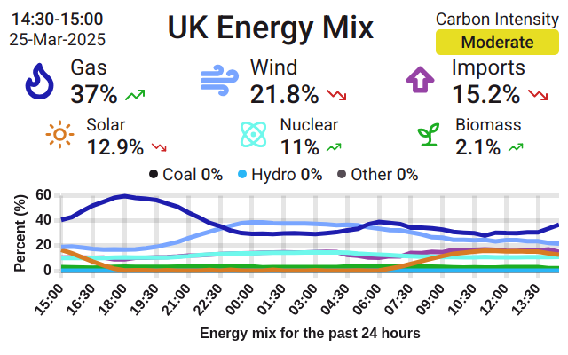
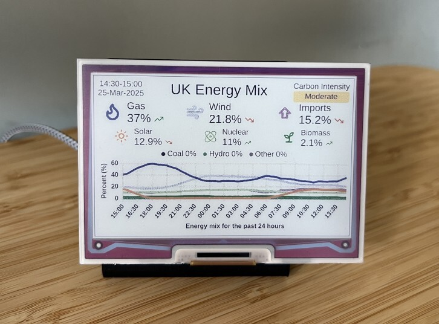
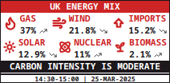
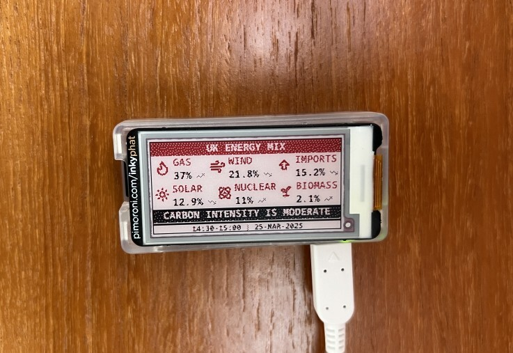
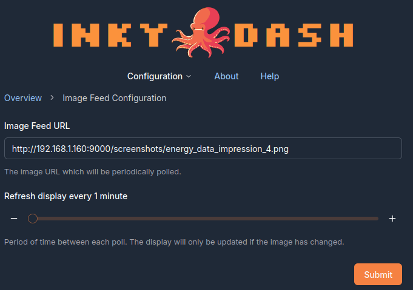

# `Inky Dash Energy Mix Image Feed`

Generates an image that displays the energy mix data for the UK from
the [Carbon Intensity API](https://api.carbonintensity.org.uk/generation). Intended to be used in conjunction with
the [Inky Dash](https://github.com/r-rayns/inky_dash) image-feed mode.

## Output 🖼️

Multiple images can be output for different types of display configurations. Supported displays are:

- [Inky pHAT (212 x 104)](https://shop.pimoroni.com/products/inky-phat?variant=12549254217811)
- [Inky pHAT (250 x 122)](https://shop.pimoroni.com/products/inky-phat?variant=12549254217811)
- [Inky Impression 4"](https://shop.pimoroni.com/products/inky-impression-4?variant=39599238807635)
- [Inky Impression 5.7"](https://shop.pimoroni.com/products/inky-impression-5-7?variant=32298701324371)
- [Inky Impression 7.3"](https://shop.pimoroni.com/products/inky-impression-7-3?variant=40512683376723)

The images are produced by processing a Jinja template using the data returned from the Carbon Intensity API and
taking a screenshot of the rendered HTML using [playwright](https://playwright.dev/).
There are two templates, both scaling to fit the chosen display size, one for the Inky Impression displays and another
paired-back template for the smaller Inky pHAT displays.

**Example output for an Inky Impression 4"**





**Example output for a 212x104 Inky pHAT (red palette)**





### Displaying on an Inky display

All the generated images are stored in the `screenshots` directory. The images are generated every 15 minutes from the
start of the hour. If you are using the `--server` flag, the image will be hosted on localhost under
`screenshots/<image_name>.png`. Where `<image_name>` depends on the display you are generating the image for:

- `energy_data_phat_104_red.png` for a 212x104 Inky pHAT (red palette)
- `energy_data_phat_104_yellow.png` for a 212x104 Inky pHAT (yellow palette)
- `energy_data_phat_104_black.png` for a 212x104 Inky pHAT (black palette)
- `energy_data_phat_122_red.png` for a 250x122 Inky pHAT (red palette)
- `energy_data_phat_122_yellow.png` for a 250x122 Inky pHAT (yellow palette)
- `energy_data_phat_122_black.png` for a 250x122 Inky pHAT (black palette)
- `energy_data_impression_4.png` for an Inky Impression 4"
- `energy_data_impression_4.png` for an Inky Impression 5.7"
- `energy_data_impression_7.png` for an Inky Impression 7.3"

#### Example

If you are running on a local network and generating an image for Inky Impression 4" then the URL may look like:

```bash
http://192.168.1.160:9000/screenshots/energy_data_impression_4.png
```

Where `192.168.1.160` is the local IP address of the device running the service. The URL should then be set in the
"Image Feed Configuration" section of Inky Dash.



## Setup 🛠️

**This project does not run on ARMv6 architecture, see [limitations](#limitations).**

### 1. Download the project

Download this repository onto the device you wish to run it from. This does not have to be the same device that is
hosting [Inky Dash](https://github.com/r-rayns/inky_dash).

### 2. Install Dependencies

Next install the project dependencies.

The best way to install dependencies is to create a new Python virtual environment:

```bash
# Create the virtual environment directory, if it doesn't already exist
mkdir ~/venv
# Create the virtual environment
python3 -m venv ~/venv/inky-uk-energy
# Activate the virtual environment
source ~/venv/inky-uk-energy/bin/activate
```

then run the following, from the project root:

```bash
pip install -r requirements.txt
```

One of the dependencies installed by pip is Playwright, which requires an additional installation step.

### 3. Setup Playwright

[Playwright](https://playwright.dev/) is used to take a screenshot of the rendered HTML, but first you must run the
playwright install command.
I have gone with the chromium shell only installation as it is a smaller download than the full browser.

If your virtual environment is not already active, activate it:

```bash
source ~/venv/inky-uk-energy/bin/activate
```

then run:

```bash
playwright install chromium --only-shell --with-deps
```

### 4. Create a `.env` file in the project root

A `.env` file is used to configure the project to generate the images you wish to use.

Create a `.env` file in the project root and copy the following contents into it:

```bash
# Inky pHAT (212 x 104) red palette
pHAT_104_red=false
# Inky pHAT (212 x 104) yellow palette
pHAT_104_yellow=false
# Inky pHAT (212 x 104) black palette
pHAT_104_black=false
# Inky pHAT (250 x 122) red palette
pHAT_122_red=false
# Inky pHAT (250 x 122) yellow palette
pHAT_122_yellow=false
# Inky pHAT (250 x 122) black palette
pHAT_122_black=false
# Inky Impression 4"
IMPRESSION_4=false
# Inky Impression 5.7"
IMPRESSION_5=false
# Inky Impression 7.3"
IMPRESSION_7=false
```

Change the values to `true` if you want to generate an image for that display.

## Running 🏃

To run the project go to the project root and execute:

```bash
# Running the project with both server and port flags
python3 -m src.app --server --port 9923
```

The recommended way to run this project is as a service. This ensures it starts automatically on boot and stays running
in the background as a managed process. To do that, follow these steps:

### 1. Crate a `.service` file

Change directories to:

```bash
cd /etc/systemd/system/
```

and create a new `.service` file:

```bash
touch inky_uk_energy.service
```

### 2. Edit the file

Copy the example below into the new file.

- `WorkingDirectory` points to the project directory.
- `ExecStart` path should use the Python binary in the virtual environment you set up, to run `src.app.py`.
- `your_username` should be replaced with the correct username.

*Consider what [flags](#flags) you might like to use for the `ExecStart` command. Here I use the `--server` flag to host
the
images.*

```bash
[Unit]
Description=Inky UK Energy Image Generator
After=network.target

[Service]
User=<your_username>
WorkingDirectory=/home/<your_username>/inky_uk_energy/
ExecStart=/home/<your_username>/venv/inky-uk-energy/bin/python3 -m src.app --server
Restart=always

[Install]
WantedBy=multi-user.target
```

Save the file.

### 3. Start the service

You'll now need to refresh the systemd daemon and enable the service:

```bash
# Refresh systemd so your new service is detected
sudo systemctl daemon-reload
# Enable your new service so it starts on boot
sudo systemctl enable inky_uk_energy
# Start your new service
sudo service inky_uk_energy start
```

### Flags

- `--server`: Starts a basic HTTP server that hosts the generated image.
- `--port`: Port the server should listen on, **default 9000**.

## Limitations

Due to the use of Playwright, ARMv6 devices are not supported. If your Inky Display is attached to an ARMv6 device you
can still display the images generated by this project, you'll just need to run this project on a different device.

## Development 🧑‍💻

### Updating dependencies

Dependencies are managed using [Poetry](https://python-poetry.org/). The requirements.txt file has been generated using
Poetry export:

```bash
poetry export --without-hashes -f requirements.txt -o requirements.txt
```

## Attribution 🏷️

- This project uses data from the [Carbon Intensity API](https://api.carbonintensity.org.uk/generation) to generate the
  image.
- Icons are from [Lucide](https://lucide.dev/license).
